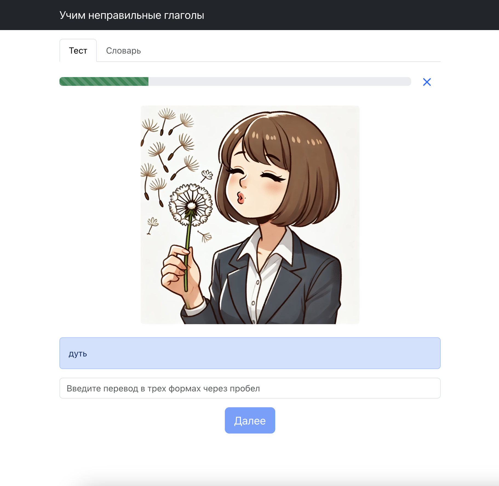

# Irregular verbs

[](https://github.com/const-y/irregular-verbs/actions)
[](https://sonarcloud.io/summary/new_code?id=const-y_irregular-verbs)

Приложение для запоминания английских неправильных глаголов




## Live demo

Нажмите [here](https://const-y.github.io/irregular-verbs/) чтобы открыть

## Установка и локальный запуск

1. Склонируйте репозиторий
2. В папке проекта выполните

```shell
make install
make dev
```
