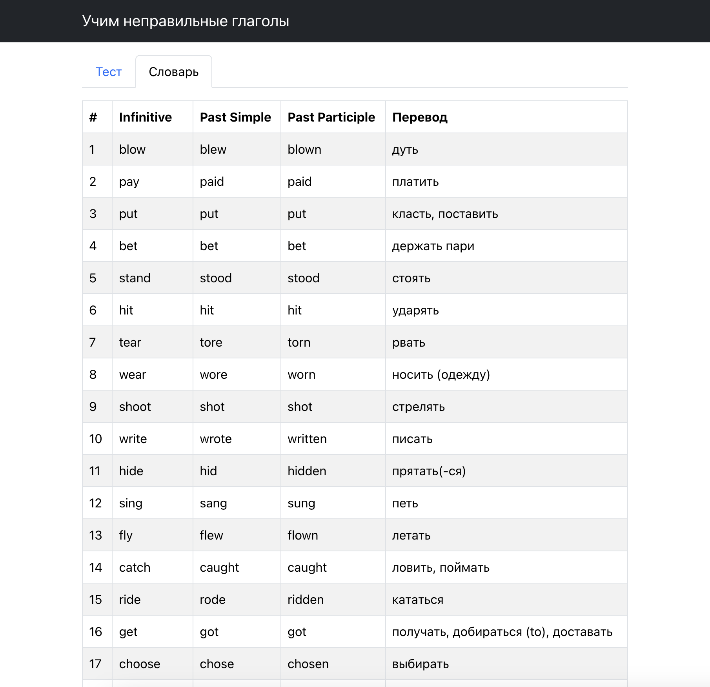

# Irregular verbs

[](https://github.com/const-y/irregular-verbs/actions)
[](https://codeclimate.com/github/const-y/irregular-verbs/maintainability)
[](https://codeclimate.com/github/const-y/irregular-verbs/test_coverage)

Приложение для запоминания английских неправильных глаголов




## Live demo

Нажмите [here](https://const-y.github.io/irregular-verbs/) чтобы открыть

## Установка и локальный запуск

1. Склонируйте репозиторий
2. В папке проекта выполните

```shell
make install
make dev
```
